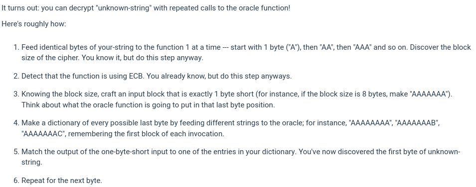

# Cryptopals Set 2 - Block Crypto

## PKCS#7 Padding 

## CBC mode 

## Detecting ECB/CBC
The concept is same as used previously. If there are repeating blocks in a ciphertext, then the mode used is ECB else it is CBC. 

That's why the plaintext input is repeating a's so that there will be some repeating blocks in ciphertext that will help in detecting mode.

## Attacking ECB - byte at a time decryption
